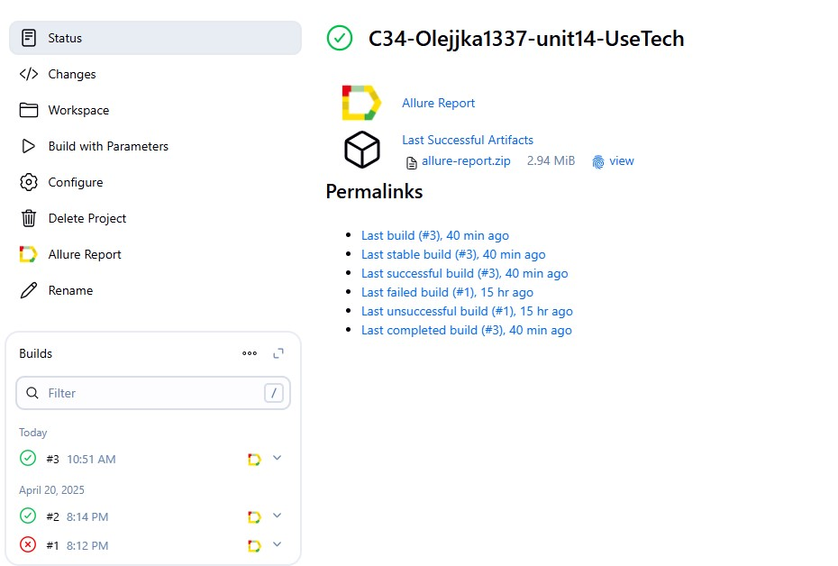

<h1 >Демопроект по автоматизации тестирования сайта <a href="https://usetech.ru/ "> Usetech</a></h1>

## ☑️ Содержание:

- Технологии и инструменты
- Список проверок, реализованных в тестах
- Запуск тестов (сборка в Jenkins) и из терминала
- Allure-отчет
- Уведомление в Telegram о результатах прогона тестов
- Видео пример прохождения тестов

<a id="tools"></a>
## :ballot_box_with_check:Технологии и инструменты:

|         Java                                                                                                      | IntelliJ  <br>  Idea                                                                                               | GitHub                                                                                                     | JUnit 5                                                                                                           | Gradle                                                                                                     | Selenide                                                                                                         | Selenoid                                                                                                                  | Allure <br> Report                                                                                                         |  Jenkins                                                                                                        |   Telegram
|:----------------------------------------------------------------------------------------------------------|--------------------------------------------------------------------------------------------------------------------|------------------------------------------------------------------------------------------------------------|-------------------------------------------------------------------------------------------------------------------|------------------------------------------------------------------------------------------------------------|------------------------------------------------------------------------------------------------------------------|---------------------------------------------------------------------------------------------------------------------------|----------------------------------------------------------------------------------------------------------------------------|-----------------------------------------------------------------------------------------------------------------|---------------------------------------------------------------------------------------------------------------------|
| <a href="https://www.java.com/"></a>  | <a href="https://www.jetbrains.com/idea/"></a> | <a href="https://github.com/"></a> | <a href="https://junit.org/junit5/"></a> | <a href="https://gradle.org/"></a> | <a href="https://selenide.org/"></a> | <a href="https://aerokube.com/selenoid/"></a> | <a href="https://github.com/allure-framework"></a> |<a href="https://www.jenkins.io/"></a> | <a href="https://web.telegram.org/"></a> |<a href="https://qameta.io/"></a> |

<a id="cases"></a>
## :ballot_box_with_check: Реализованные проверки:

- Проверка на количество кнопок в header меню на главной странице
- Переходим с главной страницы на страницу Новости и проверяем текст на заголовок с текстом "Новости"
- Переходим с главной страницы на страницу Контакты и проверяем текст на заголовок с текстом "Контакты"
- Переходим с главной страницы на страницу Продукты и проверяем текст на заголовок с текстом "Продукты"
- Переходим с главной страницы на страницу Награды и проверяем текст на заголовок с текстом "Награды"

##  Сборка в [Jenkins](https://jenkins.autotests.cloud/job/C34-Olejjka1337-unit14-UseTech/)


<p align="center">  
</a>  
</p>


## :ballot_box_with_check: Параметры сборки в Jenkins:

- browser (браузер, по умолчанию chrome)
- browserVersion (версия браузера, по умолчанию 127.0)
- browserSize (размер окна браузера, по умолчанию 1920x1080)


## Команда для запуска из терминала

Удаленный запуск с использованием Jenkins+Selinoid(требуется логин и пароль):
```bash  
gradle clean UseTech -Denv=remote
```

## </a>  <a name="Allure"></a>Allure Report	</a>


## Основная страница отчёта

<p align="center">  
  
</p>  

## Тест-кейсы

<p align="center">  
  
  
</p>


##  </a>Интеграция с Allure TestOps</a>


## Allure TestOps Dashboard

<p align="center">  
  
</p>  

## Авто и Ручные тест-кейсы

<p align="center">  
  
  

</p>

## </a> Интеграция с <a target="_blank" href="https://jira.autotests.cloud/browse/HOMEWORK-689">Jira</a>

<p align="center">  
  
</p>

____
## </a> Уведомление в Telegram при помощи бота
____
<p align="center">  
  
</p>

____
## </a> Примеры видео выполнения тестов на Selenoid
____
<p align="center">
   
</p>
